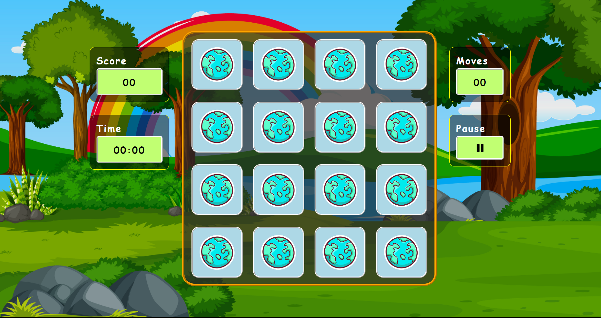
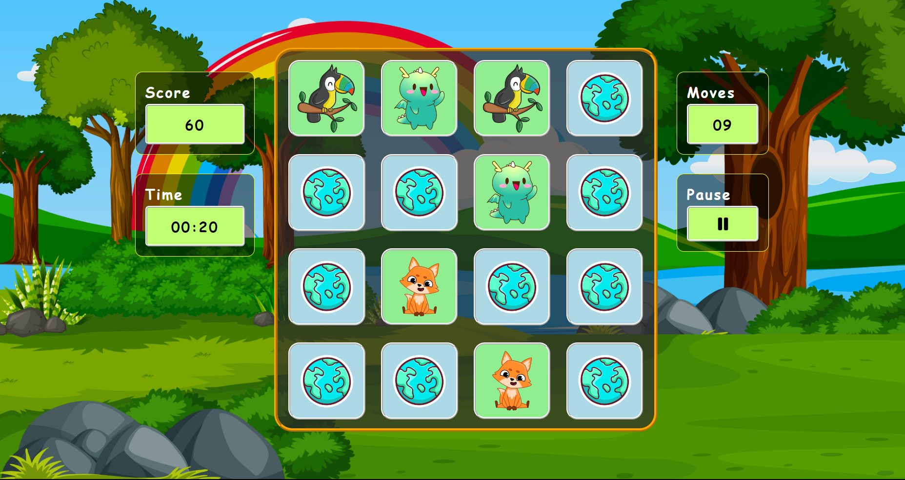
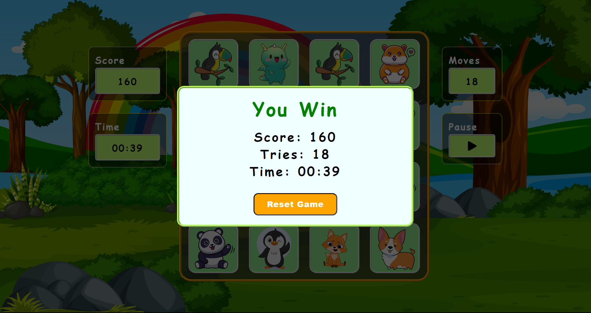
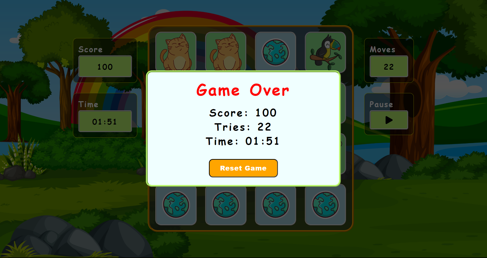

# 🐾 Animal Match - Memory Game 🎮

Animal Match is an interactive memory game where players flip cards to find matching pairs of animal images. The game keeps track of the score, time, and the number of attempts made. 

## Features ✨

- **Dynamic Card Flipping**: Flip cards to reveal images. 🔄
- **Score Tracking**: Earn points for each match. 🏆
- **Timer**: Track how long you've been playing. ⏱️
- **Pause and Reset Options**: Pause the game or reset to start over. ⏸️🔄
- **Responsive Design**: Plays well on both desktop and mobile devices. 📱💻

## Demo 🌐

[Live Preview](https://animalmatchup.netlify.app)

## Screenshots 📸

1. **Game Start Screen**  
   

2. **In-Game View**  
   

3. **Game Win Screen**  
   

4. **Game Over Screen**  
   

## Technologies Used 🛠️

- HTML
- CSS
- JavaScript
<<<<<<< HEAD
- Audio (for game sounds)
=======
- Audio (for game sounds)
>>>>>>> 7341184ead04c1d0d9c858e3c1392552b83cbdff
